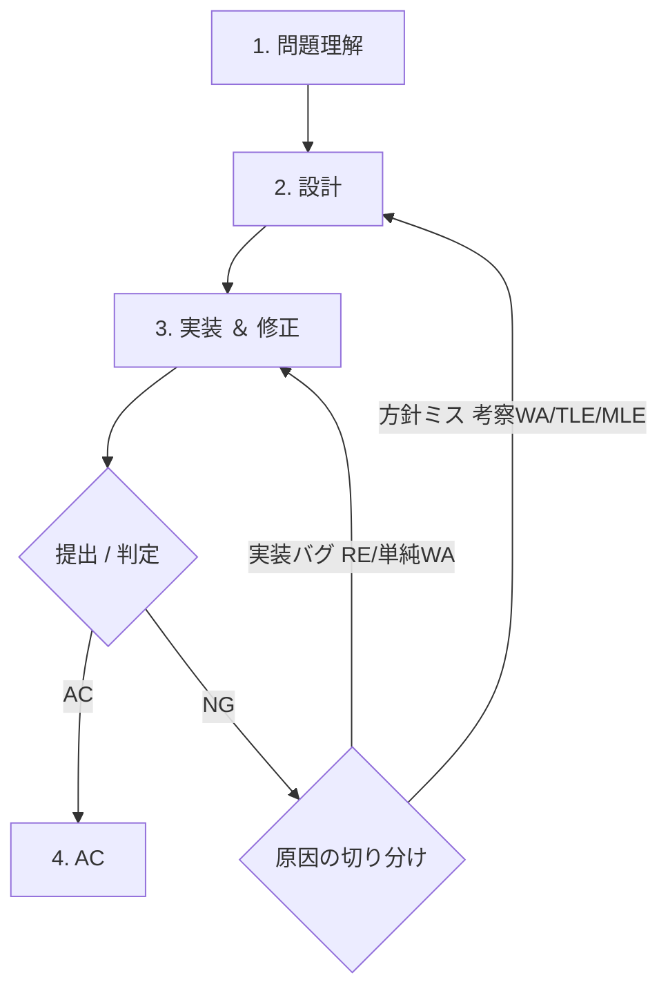

# 解法フロー — 問題理解から AC まで（Level 1〜5）

1 問を AC するまでの **流れ（フェーズ）** と、その中の **小分類**、そしてフロー全体を貫く **本質スキル** を分けて整理した地図。
精選問題は `docs/problem-set.md`、手法当ては `docs/typical-patterns.md`、実装は `lib/` を参照。

---

## 全体フロー

判定 NG の戻り先は原因しだい: **実装バグなら工程3** で直す、**方針・イメージの誤り（計算量オーバーの TLE 含む）なら工程2** に戻ってイメージから作り直す。この切り分けが修正の最初の一手。

ポイントは **設計で計算量とメモリを見積もってから実装に入る**こと。Level 4 以降はここを飛ばすと TLE/MLE で手戻りが激増する。

### 解くとは「アイデア → イメージ → コード」

| 段階                 | 中身                                                                                     | どの工程   |
| -------------------- | ---------------------------------------------------------------------------------------- | ---------- |
| **アイデア（方針）** | どの手法で解くか（例: 貪欲）                                                             | 設計の入口 |
| **イメージ**         | その手法を具体例で頭の中で動かした、変数の状態と遷移の絵。**要点（キモ）**もここで見える | 設計の出口 |
| **コード**           | イメージを言語の文法に写したもの                                                         | 実装       |

実装は「アイデアをコードにする」のではなく「**イメージをコードにする**」。アイデアから直接コードに飛ぶと手が止まる。

---

## 1. 問題理解

「何を求めるか」と「入力の形・大きさ」を取り違えないフェーズ。ここのミスは全部下流に波及する。

| 小分類             | やること                                                              |
| ------------------ | --------------------------------------------------------------------- |
| 出力の種類         | 最大化 / 最小化 / 数え上げ / 存在判定 / 構築 のどれか                 |
| 制約の把握         | N の上限、値域（→ 計算量とオーバーフローの予感）                      |
| サンプルのトレース | 入力例を手で追い、出力例が出るか確認                                  |
| **最小ケース**     | N=0,1 / 空 / 全部同じ / 最大値 を先に頭出ししておく                   |
| 言い換え           | 「グラフに見える」「逆から見ると単純」等（→ typical-patterns の定石） |

> 最小ケースはここで**先に**考えておくと、修正フェーズで効く（後述）。

---

## 2. 設計

アイデア（方針）を、コードにできるレベルの**具体的なイメージ**まで落とすフェーズ。
手順を具体例で頭の中で動かし（イメージする作業）、**この問題の要点（キモ）**を見つける。

| 小分類               | やること                                                                   |
| -------------------- | -------------------------------------------------------------------------- |
| 計算量の上限を逆算   | N≤20→bit全探索 / N≤500→O(N³) / N≤10⁵→O(N log N) / N≤10⁶→O(N)               |
| **アルゴリズム選定** | 問題の特徴 → 手法（`docs/typical-patterns.md`）。＝アイデアを決める        |
| **要点を見つける**   | この問題の難所はどこか（例:「色 M 種類の縛り」だけが本質、残りは大きい順） |
| **イメージする作業** | 具体例で手順を頭で動かし、変数の状態遷移を言葉/紙/図にする                 |
| **データ構造選定**   | 配列 / set / map / queue・stack / 優先度付きキュー / Union-Find / セグ木   |
| メモリ見積もり       | 2次元 10⁴×10⁴ = 10⁸ は危険、型と次元を意識                                 |

→ イメージの作り方の実例: `docs/examples/abc461-c-variable-trace.html`
→ 実装スニペット: `lib/ds/`, `lib/search/`, `lib/dp/`, `lib/graph/`

---

## 3. 実装 ＆ 修正

設計で作った**イメージをコードに落とし**、動かして直すフェーズ。書く→試す→直すを小さく回す。
実装は「アイデアをコードに」ではなく「**イメージをコードに**」。＝言語理解（実装力）が試される。

### 実装（イメージ → コード）

| 小分類           | やること                                                  |
| ---------------- | --------------------------------------------------------- |
| 構造化           | 入力パース → コア処理 → 出力 に分けて書く                 |
| 容器と中身の対応 | イメージの各変数（箱）と中身を、コードの宣言に 1:1 で写す |
| 部分確認         | 小さく作って途中の配列を出力して確かめる                  |
| 言語の罠         | オーバーフロー（Int / Long）、0-index、配列外、整数除算   |
| 配列操作         | 走査・集計・2次元・ネストループを手癖で（Level 2 の土台） |

> 「方針は立つのに手が止まる」＝イメージ→コードの力（言語理解）不足。Level 2 の配列ドリルで埋める。

### 修正（サンプル不一致・提出結果への対処）

症状ごとに当たる場所が違う。

| 症状               | 小分類                 | 対処                                                       |
| ------------------ | ---------------------- | ---------------------------------------------------------- |
| サンプルが合わない | 最小ケースで二分       | 小さい入力で期待値と途中経過を突き合わせる                 |
| WA（誤答）         | **見落としケース探し** | 0 / 1 / 最大値 / 同値 / 空 / 負 のコーナー、考察の穴       |
| TLE（時間超過）    | **実行時間改善**       | ループ削減、前計算・累積、枝刈り、計算量の見直し           |
| MLE（メモリ超過）  | **メモリ改善**         | 配列の再利用、型を縮める、次元を減らす、不要な保持をやめる |
| RE（実行時エラー） | 例外箇所の特定         | 配列外、0除算、再帰深すぎ、オーバーフロー                  |

> まず「**イメージ（考察）が間違い**」か「**実装がバグ**」かを切り分ける（最小ケースが道具）。
> 前者（考察 WA・計算量オーバーの TLE・構造が重い MLE）は**工程2へ戻ってイメージから作り直す**。後者（RE・単純な WA）は**ここ＝工程3で直す**。

---

## 4. AC

通ったら終わり、ではなく**振り返り**まで。

- 詰まった原因はどのフェーズ／どの本質スキルだったか
- 使った手法を `docs/typical-patterns.md` の引き出しに追加できるか
- 同種の問題を 1 問追加で解いて定着

---

## フローを貫く本質スキル

フェーズが「手順」なら、これは「各手順をどれだけ上手くこなせるか」を決める縦串の力。

| 記号 | 本質スキル             | 中身                                                        | 主に効くフェーズ |
| ---- | ---------------------- | ----------------------------------------------------------- | ---------------- |
| A    | **アルゴリズム選定力** | 制約→計算量→手法の対応づけ。典型の引き出しの数              | 設計             |
| B    | **言語理解（実装力）** | イメージをそのままコードにする。言語機能を手癖で使う        | 実装＆修正       |
| C    | **考察力**             | 言い換え・不変量・単調性・余事象（typical-patterns の定石） | 問題理解・設計   |
| D    | **デバッグ力**         | 仮説検証、最小ケースでの二分、コーナー想像                  | 実装＆修正       |

### Level ごとに効くスキル（〜5）

| Lv  | 流れの実感                           | 支配的スキル                          |
| --- | ------------------------------------ | ------------------------------------- |
| 1   | 理解→実装→AC のほぼ直線              | B（言語理解）                         |
| 2   | 配列操作を思うがままに               | **B が主役**（土台づくり）            |
| 3   | 「全部試す」と気づき書く             | A（全探索の選定）＋ B                 |
| 4   | 典型を選んで当てる                   | **A（典型選定）**＋ D                 |
| 5   | 典型を変形・合わせ技、TLE/MLE と戦う | A ＋ C（考察）＋ 修正（時間・メモリ） |

---

## 詰まった所 → 鍛える所（逆引き）

| 詰まり方                   | 足りない本質スキル  | 強化先                                     |
| -------------------------- | ------------------- | ------------------------------------------ |
| 何をすればいいか分からない | C 考察力            | typical-patterns の定石 / 最小ケースで実験 |
| 方針は立つのに手が止まる   | B 言語理解          | `problem-set.md` Level 2 の配列ドリル      |
| 解法が思いつかない         | A アルゴリズム選定  | typical-patterns 逆引き / 典型を埋める     |
| サンプルが合わない         | D デバッグ力        | 最小ケースで二分、途中出力                 |
| TLE になる                 | A ＋ 計算量見積もり | 設計での逆算を習慣化、前計算・枝刈り       |
| MLE / RE になる            | B 言語の罠          | 型・次元・配列外・オーバーフローの確認     |

---

## 関連 doc

- 段階別の精選問題: `docs/problem-set.md`
- 手法の逆引き・考察の定石: `docs/typical-patterns.md`
- 制約と計算量の対応: `docs/constraints-complexity.md`
- 実装スニペット: `lib/`
